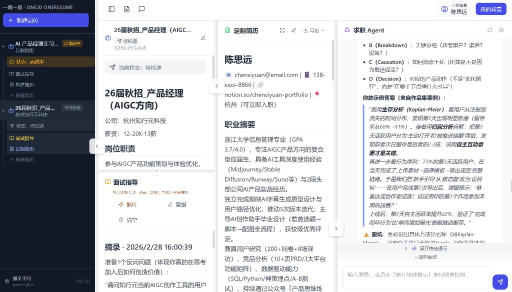

<div align="center">

# OneJD OneResume

### An AI workbench for job-specific resumes, interview preparation, and repeatable application workflows



<br/>

[](https://brocademaple.github.io/one_jd_one_resume/)
[](https://github.com/brocademaple/one_jd_one_resume)
[](https://github.com/brocademaple/one_jd_one_resume)

<br/>

[](#supported-ai-providers)
[](https://github.com/brocademaple/one_jd_one_resume)

**OneJD OneResume** is a public AI job-search workbench built around a simple idea: every job description deserves its own application workspace.

Languages: English | [简体中文](./README.zh-CN.md)

The project connects job descriptions, tailored resumes, interview notes, custom question banks, mock interviews, and review reports into a reusable workflow. It is designed for candidates, career coaches, and builders who want a structured way to turn application materials into an iterative, evidence-based process.

**Live demo:** [https://brocademaple.github.io/one_jd_one_resume/](https://brocademaple.github.io/one_jd_one_resume/)

</div>

---

## Why This Project Exists

Most resume tools focus on rewriting a single resume. Real job search work is messier: each role has different expectations, each resume version needs context, and interview preparation should be connected to the same job description and candidate background.

OneJD OneResume treats a job application as a small knowledge workspace:

- one job description
- one or more tailored resume versions
- interview guidance notes
- job-specific question banks
- mock interview sessions
- review reports and exportable documents

The goal is to make each application traceable, reusable, and easier to improve over time.

---

## Features

- **Job description management**: Create, edit, delete, and track job descriptions with status and source links.
- **AI resume tailoring**: Generate job-specific resumes from a job description and candidate background.
- **Interview guide workspace**: Maintain Markdown interview notes for each job, including snippets collected from AI conversations.
- **Mock interview flow**: Generate or regenerate job-specific question banks, sample questions by type, run mock interviews, and produce Markdown review reports.
- **Multiple candidate background profiles**: Maintain multiple candidate profiles and switch between them when generating resumes or interview materials.
- **Resume PDF parsing**: Upload a resume PDF and convert it into structured candidate-background Markdown through an LLM workflow.
- **Conversational editing**: Use natural-language prompts to generate, refine, and revise application materials.
- **PDF and Word export**: Preview output, adjust font size and margins, then export resumes as PDF or Word documents.
- **File management**: Organize tailored resumes and interview guides under each job.
- **Multi-provider LLM support**: Switch between Anthropic Claude and OpenAI-compatible providers such as Qwen, Zhipu GLM, DeepSeek, Moonshot Kimi, and Baidu ERNIE.

---

## Architecture

```text
Browser
  |
  | React + TypeScript + Tailwind CSS + Zustand
  |
  | REST API / Server-Sent Events
  v
FastAPI backend
  |
  | jobs, resumes, conversations, background profiles
  v
SQLite + SQLAlchemy
  |
  | provider abstraction
  v
Anthropic SDK / OpenAI-compatible SDKs
```

The application is split into a TypeScript frontend and a Python FastAPI backend.

### Frontend

- React 18
- TypeScript
- Tailwind CSS
- Vite
- Zustand state management

### Backend

- Python
- FastAPI
- SQLite
- SQLAlchemy ORM
- Server-Sent Events for streaming AI responses
- ReportLab for PDF export
- python-docx for Word export

---

## Core Workflow

```text
User message
  |
  v
ChatPanel.tsx
  |
  | POST /api/chat/stream
  | { job_id, resume_id, messages[], user_background }
  v
FastAPI ChatRouter
  |
  | Loads Job.content and Resume.content from the database
  | Builds the system prompt with job, resume, and candidate context
  v
providers.stream_response()
  |
  | Reads ai_settings.json
  | Selects provider, model, and API key
  v
LLM streaming response
  |
  v
Server-Sent Events
  |
  v
React UI renders tokens and updates resume content when structured markers are detected
```

---

## Supported AI Providers

| Provider | Example models | Key source |
| --- | --- | --- |
| Anthropic Claude | `claude-opus-4-6` | `console.anthropic.com` |
| Qwen | `qwen-plus`, `qwen-max` | Alibaba Cloud Model Studio |
| Zhipu GLM | `glm-4-flash`, `glm-4-plus` | Zhipu AI platform |
| DeepSeek | `deepseek-chat`, `deepseek-reasoner` | DeepSeek platform |
| Moonshot Kimi | `moonshot-v1-128k` | Moonshot platform |
| Baidu ERNIE | `ernie-4.0-turbo-8k` | Baidu AI Cloud |

The backend keeps provider integration behind a shared abstraction so the UI can switch models without changing the user workflow.

---

## Quick Start

### 1. Install dependencies

```bash
# Backend
cd backend
pip install -r requirements.txt

# Frontend
cd ../frontend
npm install
```

### 2. Configure API keys

Copy the example settings file:

```bash
cp backend/ai_settings.json.example backend/ai_settings.json
```

Then add the API key for the provider you want to use.

You can also configure API keys through the application UI after starting the app.

### 3. Start the development servers

From the repository root:

```bash
./dev.sh
```

On Windows:

```bat
dev.bat
```

The frontend should be available at:

```text
http://localhost:5173
```

The backend should be available at:

```text
http://localhost:8000
```

### 4. Production-style backend startup

```bash
./start.sh
```

On Windows:

```bat
start.bat
```

---

## Usage

1. Create a job entry and paste the job description.
2. Add or select a candidate background profile.
3. Ask the AI assistant to generate a tailored resume for the selected job.
4. Review and edit the resume in the resume panel.
5. Add useful conversation excerpts to the job-specific interview guide.
6. Generate interview questions and run a mock interview.
7. Export the final resume as PDF or Word.

---

## API Overview

| Method | Path | Description |
| --- | --- | --- |
| `GET` | `/api/jobs` | List all jobs |
| `POST` | `/api/jobs` | Create a job |
| `PUT` | `/api/jobs/{id}` | Update a job |
| `DELETE` | `/api/jobs/{id}` | Delete a job |
| `GET` | `/api/resumes` | List resumes |
| `POST` | `/api/resumes` | Create a resume |
| `PUT` | `/api/resumes/{id}` | Update a resume |
| `DELETE` | `/api/resumes/{id}` | Delete a resume |
| `POST` | `/api/chat/stream` | Stream an AI conversation response |
| `GET` | `/api/chat/current-provider` | Get current model/provider settings |
| `GET` / `POST` | `/api/chat/conversations` | Read or save conversation history |
| `GET` | `/api/settings` | Read model settings |
| `PUT` | `/api/settings` | Save model settings |
| `DELETE` | `/api/settings/api-key/{provider}` | Remove a provider API key |
| `GET` | `/api/export/pdf/{id}` | Export resume as PDF |
| `GET` | `/api/export/pdf-preview/{id}` | Preview PDF rendering |
| `GET` | `/api/export/word/{id}` | Export resume as Word |
| `GET` | `/api/background/profiles` | List candidate background profiles |
| `POST` | `/api/background/profiles` | Create a background profile |
| `PUT` | `/api/background/profiles/{id}` | Update a background profile |
| `DELETE` | `/api/background/profiles/{id}` | Delete a background profile |
| `POST` | `/api/uploads/extract` | Extract text from an uploaded file |
| `POST` | `/api/uploads/parse-resume-background` | Parse a resume PDF into candidate-background Markdown |
| `POST` | `/api/uploads/parse-job` | Parse job information from an uploaded file |

---

## Security Notes

This project handles user-provided job descriptions, resume text, uploaded files, LLM prompts, generated documents, and local API-key configuration. Current security-sensitive areas include:

- file upload and parsing
- prompt-injection surfaces in JD/resume text
- generated PDF and Word output
- local API-key storage
- dependency and provider SDK updates

Contributions that improve validation, dependency hygiene, prompt safety, secret handling, and test coverage are especially valuable.

---

## GitHub Pages

The static project showcase is served from:

```text
docs/index.html
docs/styles.css
docs/assets/
```

If GitHub Pages is not enabled yet, use:

```text
Settings -> Pages -> Deploy from a branch -> main / docs
```

---

## Roadmap

- Add an English UI mode and documentation set.
- Improve automated tests for backend routes and provider switching.
- Add stricter validation for uploads and generated exports.
- Add contribution guidelines and issue templates.
- Add a public license file.
- Improve GitHub Pages documentation with architecture and demo screenshots.

---

## Contributing

Issues and pull requests are welcome. Useful contribution areas include:

- improving the resume and interview workflows
- adding tests for FastAPI routes
- improving security and input validation
- expanding provider support
- improving documentation and setup instructions
- making the UI more accessible

---

## License

This repository does not currently include a license file. If you plan to accept external contributions or present it as an open-source project, add an OSI-approved license such as MIT or Apache-2.0.
